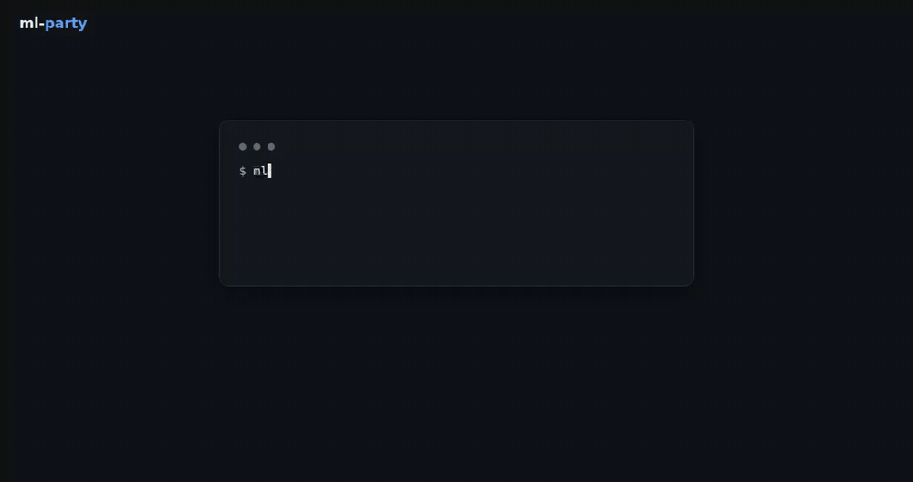

<p align="center">
  
</p>

<p align="center">
  <a href="https://github.com/paul-krug/ml-party/actions/workflows/ci.yml"></a>
  <a href="https://pypi.org/project/mlparty/"></a>
  <a href="https://paul-krug.github.io/ml-party/"></a>
</p>



**An agent-native platform for ML experiment tracking and lineage/knowledge.**

Every existing tracker is human-dashboard-first: great at scalars-over-time,
silent about *why* a run exists and *how it relates* to the others. ml-party
treats a run's **abstract, typed relationships, and reproducibility contract
as first-class data** — a durable, queryable lab notebook that agents write
(over MCP) and query, and that humans read live (CLI + web viewer). It is
also a full local tracker: metrics, artifacts, checkpoints, all stored
locally; mirroring to W&B/MLflow is a future optional adapter, not the
product.

Core ideas:

- **The write contract is the product.** `run_start` pre-registers intent
  (title, purpose, hypothesis, full parameters) and auto-captures the repro
  tuple (source snapshot, env lock, invocation, hardware, outer-git
  provenance). `run_finalize` refuses without method + result/verdict +
  reproduce — refusals are machine-readable `{missing, invalid}`. Failures
  are knowledge (`run_fail`); silent deaths become `abandoned`.
- **Internal git per experiment.** Every run snapshots the actually-running
  source (allowlisted, size-capped, secrets denied) as a commit in a bare
  internal repo. A run *references* a commit — a launch-arg sweep is many
  runs on one commit, distinguished by mandatory `parameters`. Declared
  `derives_from` lineage becomes the commit's parent; every run gets its own
  ref (no races).
- **A knowledge graph over it.** Typed nodes (`project / experiment / run /
  note`), a controlled edge vocabulary (`derives-from`, `supersedes`,
  `refutes`, …), hybrid BM25(+optional embeddings)+graph retrieval that
  downranks superseded/refuted beliefs. Knowledge is append-only; correction
  is an edge.
- **Boards: agents author whole views.** An agent logs a self-contained
  HTML page as an artifact and the UI renders it sandboxed — comparison
  dashboards, demo galleries, live reports that fetch current data from the
  read-only API at view time ([boards guide](https://paul-krug.github.io/ml-party/boards.html)).
- **Run control through registered templates.** Users register shell
  templates with typed placeholders — the allowlist; agents invoke them
  with validated, shell-quoted *values* (never commands), and every
  invocation is recorded in the graph, edged to the run it controlled.
  Restart is never a mutation: a new run, `derives-from` the old
  ([run-control guide](https://paul-krug.github.io/ml-party/actions.html)).
- **Local-first, remote-ready.** Writers always write a local spool store;
  spool-and-flush sync ships runs to a served store over three idempotent
  streams ([remote-tracking guide](https://paul-krug.github.io/ml-party/remote.html)). Multi-user auth (roles,
  per-user tokens, UI login) activates with the first `mlp user add`
  ([deployment guide](https://paul-krug.github.io/ml-party/deploy.html)).

## Quickstart

**Requirements:** Linux or macOS (Windows via WSL — the store relies on
POSIX file locking) and Python ≥ 3.11. The web UI ships prebuilt in the
wheel; nothing to compile.

```bash
pip install mlparty

mlp init --root .mlparty                    # create a store (+ MCP registration)
python -m mlparty.demo &                    # a real run: contract + live metrics
mlp ui                                      # → http://127.0.0.1:7327
```

Open the browser: the demo run is streaming its loss curve live. It went
through the full lifecycle a real training does — pre-registered with
purpose/hypothesis/parameters, source snapshotted, metrics streamed, then
finalized with a verdict. Click into it: Overview | Metrics | Artifacts |
Code.

### Let an agent drive it

`mlp init` registered the MCP server in `./.mcp.json`, so agents started in
this project (Claude Code and compatible clients) pick it up automatically —
approve it once when asked. The server is **self-teaching**: the full
tracking workflow rides in its MCP instructions, so *"use ml-party for this
run"* is all an agent needs to hear. Other setups: `mlp connect` registers
an existing store into another project; `mlp mcp-config` prints the snippet
for other MCP clients.

### Instrument a training script

The agent brackets the run over MCP and launches your script with
`ML_PARTY_STORE`/`ML_PARTY_RUN` set; the script attaches as the second
writer:

```python
import mlparty

h = mlparty.attach()                        # env-var handshake (inert without ML_PARTY_RUN)
h.log_metric("loss", loss, step=step)       # streams to the live view
h.log_artifact("ckpt/best.pt")
h.finalize(method=..., result={"summary": ..., "verdict": "confirmed",
                               "metrics": {"wer": 0.048}},
           reproduce="python train.py --lr 1e-3")
# unhandled exceptions auto-fail the run with the traceback
```

CLI mirror: `mlp status / runs / show <ref> / tail <run> / query "…" /
diff <a> <b> / janitor / rebuild-index`.

## Web viewer

`mlp ui` serves a read-only SPA: experiments → runs → tabbed run pages with
live SSE metric dashboards, a finder-style artifact browser (image/audio/
video viewers, an `.npy`/`.npz` tensor slicer), agent-authored boards, the
lineage graph, search, and diff. Remote box → tunnel like TensorBoard:
`ssh -L 7327:localhost:7327 <box>`. For a shared server with logins and
sync ingest, see the [deployment guide](https://paul-krug.github.io/ml-party/deploy.html)
and the [remote-tracking guide](https://paul-krug.github.io/ml-party/remote.html).

## From source

For development, or to run an unreleased revision — needs Node ≥ 20, since
the UI bundle is built rather than downloaded:

```bash
git clone https://github.com/paul-krug/ml-party && cd ml-party
python -m venv .venv && .venv/bin/pip install -e .
(cd ui && npm install && npm run build)     # web UI bundle, once
.venv/bin/python -m pytest tests/ -q
```

Contributions: [CONTRIBUTING.md](CONTRIBUTING.md) for the flow and the
maintainer-only paths, [AGENTS.md](AGENTS.md) for conventions,
[SECURITY.md](SECURITY.md) for the trust model.

## Design

- **[User guide](https://paul-krug.github.io/ml-party/)** (rendered from
  [docs/](docs/)): [tracking runs](https://paul-krug.github.io/ml-party/tracking.html),
  [the web UI](https://paul-krug.github.io/ml-party/ui.html),
  [boards](https://paul-krug.github.io/ml-party/boards.html),
  [run control](https://paul-krug.github.io/ml-party/actions.html),
  [MCP setup & tools](https://paul-krug.github.io/ml-party/mcp.html),
  [remote tracking](https://paul-krug.github.io/ml-party/remote.html),
  [deployment & auth](https://paul-krug.github.io/ml-party/deploy.html).
- [DESIGN.md](DESIGN.md) — **the living design document** (ontology,
  contract, internal-git model, storage, surfaces, remote mode, forward
  design).
- [AGENTS.md](AGENTS.md) — conventions for agents/contributors working in
  this repo (incl. the doc-sync rule). Planning lives in the repo's
  GitHub Project, not in tracked files.

Layering: pydantic ontology → journal-first store (`journal.jsonl` is the
source of truth; SQLite/FTS5 is a rebuildable index) → dulwich internal-git
engine → `MlParty` core API → thin frontends (MCP server, `mlp` CLI,
in-process client, read-only HTTP+SSE for the viewer).

## Status

Beta (0.x): APIs may still move between minor versions; the store format is
journal-first and rebuildable, and every release migrates it forward.
Licensed [Apache-2.0](LICENSE).

Tests: `.venv/bin/python -m pytest tests/ -q`
